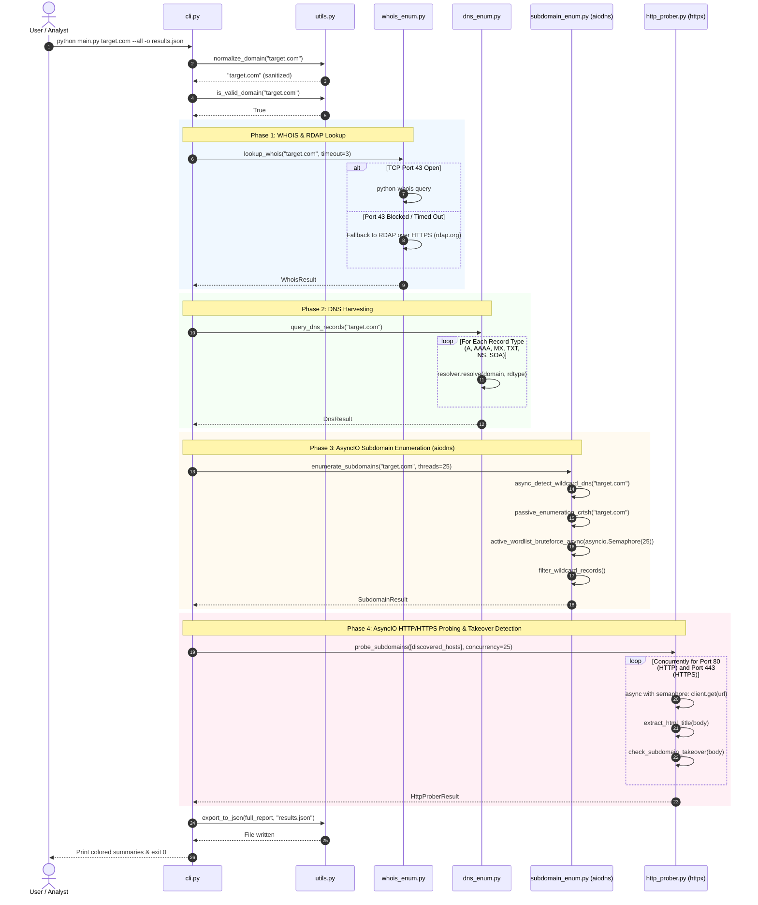

# Developer Technical Guide: Recon Toolkit (AsyncIO & HTTP Prober Architecture)

This guide documents the software architecture, design patterns, asynchronous event loop design, testing strategies, technical trade-offs, and future enhancement paths for developers maintaining or extending the **Recon Toolkit**.

---

## 1. Architecture Overview

The toolkit follows a **modular, decoupled architecture** where each reconnaissance domain (WHOIS, DNS, Subdomains, HTTP Prober) is an isolated subsystem that returns strongly typed data containers (dataclasses). 

The tool utilizes Python's native `asyncio` event loop paired with the asynchronous C-ares DNS resolver (`aiodns`) and non-blocking HTTP client (`httpx`). A central CLI orchestration layer validates input, controls concurrency via an `asyncio.Semaphore`, handles errors, and aggregates results for rendering or serialization.

### High-Level System Architecture

```
                             +------------------------+
                             |  User Command Line     |
                             |  (python main.py ...)  |
                             +-----------+------------+
                                         |
                                         v
                             +------------------------+
                             |   recon_toolkit/cli    |
                             |   Argparse & Workflow  |
                             +-----------+------------+
                                         |
         +-----------------------+-------+---------------+-----------------------+
         |                       |                       |                       |
         v                       v                       v                       v
+--------------------+  +--------------------+  +--------------------+  +--------------------+
|  whois_enum.py     |  |    dns_enum.py     |  | subdomain_enum.py  |  |   http_prober.py   |
| - python-whois     |  | - dnspython        |  | - aiodns (AsyncIO) |  | - httpx (AsyncIO)  |
| - RDAP (HTTPS 443) |  | - Core Records     |  | - asyncio.Semaphore|  | - asyncio.Semaphore|
| - EPP / Dates / NS |  | - Resolver Config  |  | - crt.sh (Passive) |  | - Ports 80 & 443   |
| - Automatic Retry  |  | - Error Isolation  |  | - Wildcard Filter  |  | - Takeover Signatures
+----------+---------+  +----------+---------+  +----------+---------+  +----------+---------+
         |                       |                       |                       |
         +-----------------------+-------+---------------+-----------------------+
                                         |
                                         v
                             +------------------------+
                             |    recon_toolkit/utils |
                             | - Domain Normalization |
                             | - Color & Formatting   |
                             | - JSON / CSV Exporters |
                             +------------------------+
```

### Module Responsibilities

| Module | File | Core Responsibility | Key Classes & Functions |
| :--- | :--- | :--- | :--- |
| **CLI Controller** | `recon_toolkit/cli.py` | Argument parsing, domain normalization, workflow dispatch, exception trapping. | `build_argument_parser()`, `run_cli()` |
| **WHOIS Engine** | `recon_toolkit/whois_enum.py` | Registration data collection via TCP 43 and HTTPS RDAP fallback. | `lookup_whois()`, `_lookup_rdap_fallback()`, `WhoisResult` |
| **DNS Engine** | `recon_toolkit/dns_enum.py` | Core record queries (`A`, `AAAA`, `MX`, `TXT`, `NS`, `CNAME`, `SOA`) with custom resolvers. | `query_dns_records()`, `get_configured_resolver()`, `DnsResult` |
| **Subdomain Engine**| `recon_toolkit/subdomain_enum.py`| High-concurrency async brute-forcing (`aiodns` + `asyncio.Semaphore`) with async wildcard filtering and passive CT search. | `enumerate_subdomains()`, `enumerate_subdomains_async()`, `async_detect_wildcard_dns()`, `SubdomainResult` |
| **HTTP Prober** | `recon_toolkit/http_prober.py` | Async HTTP/HTTPS web service probing, status code capture, HTML title extraction, and Subdomain Takeover signature matching. | `probe_subdomains()`, `probe_subdomains_async()`, `check_subdomain_takeover()`, `HttpProberResult` |
| **Utilities** | `recon_toolkit/utils.py` | Cross-platform ANSI terminal formatting, RFC domain validation, JSON/CSV serialization. | `normalize_domain()`, `is_valid_domain()`, `export_to_json()` |

---

## 2. Interaction Sequence Diagram

The following sequence illustrates the complete life cycle of a full reconnaissance scan (`--all`):



---

## 3. Developer Environment Setup

### 1. Clone & Initialize Environment
```bash
# Clone the repository
git clone https://github.com/your-org/recon-toolkit.git
cd recon-toolkit

# Create Python virtual environment
python -m venv venv

# Activate the virtual environment
# Windows (PowerShell):
.\venv\Scripts\Activate.ps1
# Linux / macOS:
source venv/bin/activate
```

### 2. Install Development Dependencies
```bash
pip install -r requirements-dev.txt
```

### 3. Running the Test Suite
The test suite utilizes Python's built-in `unittest` framework with `unittest.mock` and `AsyncMock` to ensure **100% offline, deterministic testing** without executing live network queries.

```bash
# Run all tests using unittest test runner:
python -m unittest discover -s tests -p "test_*.py" -v

# Or run with pytest:
pytest -v --cov=recon_toolkit tests/
```

### 4. Code Quality & Linting
```bash
# Code style and formatting check:
flake8 recon_toolkit tests --max-line-length=100

# Automated code formatter:
black --line-length 100 recon_toolkit tests
```

---

## 4. Technical Decisions & Design Rationale

### 1. Shift to AsyncIO Engine (`aiodns` & `pycares`)
* **Problem:** Python's standard `ThreadPoolExecutor` allocates OS-level threads. Each thread incurs a 4–8 MB stack allocation and continuous kernel context switching. Scaling thread pools beyond 50–100 threads leads to significant memory overhead and thread starvation.
* **Solution:** `aiodns` interfaces directly with `c-ares`, an asynchronous DNS resolver library written in C. Lookups are scheduled on Python's single-threaded event loop. A single process can execute thousands of concurrent lookups with minimal CPU and RAM usage.

### 2. Connection Throttling via `asyncio.Semaphore`
* **Problem:** Unbounded `asyncio.gather(*tasks)` launches all lookups simultaneously. When querying a wordlist of 10,000 subdomains, this causes operating system socket exhaustion, `EMFILE` ("Too many open files") errors, and DNS rate-limiting packet drops.
* **Solution:** An `asyncio.Semaphore(concurrency)` restricts active in-flight network queries to the user's chosen `--threads` threshold (default 25), providing high throughput while protecting system resources.

### 3. Asynchronous HTTP Probing (`httpx.AsyncClient`)
* **Problem:** Security analysts need to know which discovered subdomains host live HTTP/HTTPS services, what applications they run, and whether they are vulnerable. Using synchronous `requests` sequentially is impractically slow across hundreds of hostnames.
* **Solution:** `httpx.AsyncClient` provides non-blocking HTTP/1.1 and HTTP/2 transport. We configure `verify=False` to ensure that development environments with self-signed SSL certificates or staging hosts with expired certificates still report their HTTP status codes and `<title>` headers instead of aborting on handshake errors.

### 4. Subdomain Takeover Fingerprint Matching
* **Problem:** Subdomain takeover is a critical risk when organizations delete cloud resources (AWS S3 buckets, GitHub Pages, Heroku apps) without cleaning up DNS records.
* **Solution:** `check_subdomain_takeover()` inspects the response body against a curated signature database:
  * **AWS S3:** `NoSuchBucket`, `The specified bucket does not exist`
  * **GitHub Pages:** `There isn't a GitHub Pages site here`
  * **Heroku:** `No such app`, `herokucdn.com/error-pages/no-such-app.html`
  * **Shopify:** `Sorry, this shop is currently unavailable.`
  * **Azure Web Apps:** `404 Web Site not found`
  * **Fastly / Zendesk / Ghost / Surge.sh / Tumblr / WordPress / Bitbucket / Fly.io`

### 5. WHOIS with RDAP (HTTPS 443) Fallback
* **Problem:** Outbound TCP port 43 is blocked in many enterprise and cloud firewalls.
* **Solution:** The toolkit attempts native WHOIS via `python-whois` (port 43). If a timeout or socket error occurs, it automatically falls back to ICANN's RESTful **RDAP** protocol over HTTPS (port 443) at `https://rdap.org/domain/{domain}`, guaranteeing high reliability.

---

## 5. Future Enhancements

With the AsyncIO engine and HTTP prober in place, the following features represent natural technical extensions:

### Enhancement 1: DNS Zone Transfer (`AXFR`) Testing
* **Objective:** Automatically test all discovered authoritative nameservers for unauthenticated DNS zone transfer vulnerabilities.
* **Implementation Strategy:**
  * For each discovered NS record, issue an asynchronous AXFR query via `dns.zone.from_xfr(dns.query.xfr(ns, domain))`.
  * If a nameserver permits zone transfers, instantly download the entire master zone file and extract all internal records.

### Enhancement 2: Dynamic Subdomain Permutation & Alteration Engine
* **Objective:** Generate contextual subdomain variations based on identified naming patterns.
* **Implementation Strategy:**
  * When subdomains like `api-staging.example.com` are found, automatically generate permutations: `api-dev`, `api-test`, `api-prod`, `api-uat`, `api-v2`.
  * Feed permutations back into the `aiodns` asynchronous brute-forcer to uncover hidden development clusters.

### Enhancement 3: Automated Executive HTML / PDF Report Generator
* **Objective:** Produce executive-ready reconnaissance summary reports.
* **Implementation Strategy:**
  * Implement a Jinja2-based HTML reporting template that compiles WHOIS metadata, DNS records, interactive subdomain graphs, and screenshot previews of live web endpoints into a standalone, styled HTML/PDF security audit deliverable.
